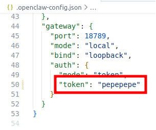
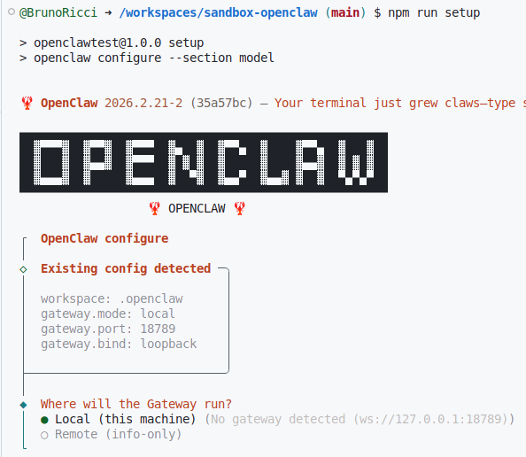
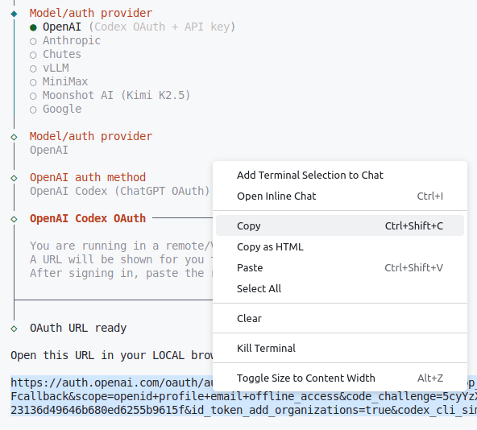
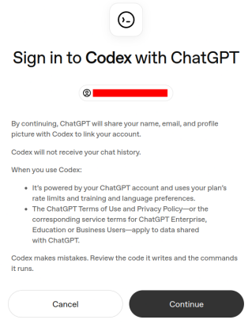
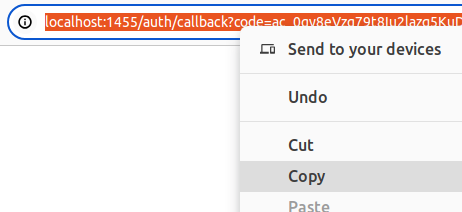
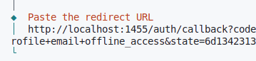

# OpenClaw Workspace

A minimal, production-ready environment for running an [OpenClaw](https://openclaw.dev) agent in GitHub Codespaces or any Docker container.

---

## What This Is

This repository provides:
- **Simple manual gateway start** — one command to spin up the OpenClaw gateway
- **Zero-friction device pairing** — auto-approves when you connect the dashboard
- **Easy model provider setup** — interactive wizard for OpenAI, Anthropic, Bedrock, etc.
- **Clean state management** — all credentials encrypted, no secrets in git

Perfect for testing agents, building demos, or --if you dare-- deploying to production.

---

## Quick Start

### 1. Open in GitHub Codespaces

Click **Code → Codespaces → Create codespace on main**

>**NOTE:**: While codespaces is a free feature, Github requires a **payment method** associated with your account in case you exceed usage limits.

_DYOR!!_

The container will:
- Install dependencies
- Generate a secure gateway token

**Time: ~2 minutes**

### 2. Start the Gateway

```bash
npm run gateway
```

**Keep this terminal open** (or open a new one), then:

### 3. Launch Dashboard

```bash
npm start
```

This:
- Prints your dashboard URL (with token embedded)
- Auto-opens it in your browser
- Watches for your device to connect
- Auto-approves when dashboard connects

**You're done — no ENTER keys, no manual approvals**

**NOTE:**  If some error appears in the web interface (OpenClaw Control) follow this simple steps:

Open `.openclaw-config.json` file -> copy the value for **"token"** node.



Paste the token into `Gateway Token` input field inside **Overview** menu. Click **Connect**.


**Done!** You should see "Status OK" in the dashboard.

---

### 4. Connect a Model Provider

```bash
npm run setup
```



Select your model provider: i.e. OpenAI



Copy URL and paste into browser -> Sign in using your credentials



Copy the URL address that appears in the URL bar _(don't worry if the page is blank or 404)_



Paste it in the terminal



### Done!

**NOTE:** The next time you open this codespace, you only need to follow steps **2** and **3**. Model provider and device pairing is saved.

---

## Repository Structure

```
.devcontainer/                  # Container config (systemd, port forwarding)
.openclaw/                      # Agent personality, memory, workspace rules
.openclaw-state/                # Runtime state: identity, credentials, models
  ├── agents/                   # Agent workspaces
  ├── identity/                 # Device keys (ED25519)
  └── credentials/              # Auth profiles (encrypted)
scripts/
  ├── init-openclaw.js          # Generate auth token (runs once)
  └── start-openclaw.js         # Launch dashboard + auto-approve
.openclaw-config.json           # Gateway config (port, token, mode)
LIFECYCLE.md                    # How the system initializes and starts
INSTRUCTIONS.md                 # What YOU need to do (start here!)
```

---

## Commands

```bash
npm start           # Launch dashboard + auto-approve device
npm run setup       # Configure model provider
npm run gateway     # Start gateway manually (if needed)
npm run health      # Check gateway status
npm run init        # Regenerate auth token
```

---

## How It Works

### Automatic (No Manual Steps)

1. **Container creates** → postCreateCommand runs:
   - npm install
   - Generate gateway token

### Manual (You Do This)

1. **`npm run gateway`** → Start gateway on port 18789
2. **`npm start`** → Shows dashboard URL, auto-approves device
3. **`npm run setup`** → Configure your model provider

See [INSTRUCTIONS.md](INSTRUCTIONS.md) for the step-by-step walkthrough.

---

## Configuration

### Gateway

Start the gateway manually each session:

```bash
npm run gateway
```

Config is in `.openclaw-config.json`:
```json
{
  "gateway": {
    "port": 18789,
    "mode": "local",
    "bind": "loopback",
    "auth": {
      "mode": "token",
      "token": "***"
    }
  }
}
```

### Model Providers

After `npm run setup`, providers are stored in:
```
.openclaw-state/agents/main/agent/models.json
```

API keys are stored securely in OpenClaw's encrypted auth profiles (not in git).

### Environment Variables (Optional)

For **GitHub Codespaces**, set these as **Codespace Secrets**:
```
OPENAI_API_KEY
ANTHROPIC_API_KEY
AWS_ACCESS_KEY_ID
AWS_SECRET_ACCESS_KEY
AWS_REGION
AZURE_OPENAI_API_KEY
AZURE_OPENAI_ENDPOINT
```

They'll be auto-injected into the container (see `devcontainer.json` `remoteEnv`).

For **local VMs**:
```bash
cp .env.example .env
# edit .env with your keys
```

---

## Troubleshooting

**Gateway not running?**
```bash
npm run gateway
```

**Token invalid?**
```bash
npm run init
npm start
```

**Model provider not working?**
```bash
npm run setup
# Re-enter your provider details
```

See [LIFECYCLE.md](LIFECYCLE.md) for more details.

---

## Files You'll Edit

- **`.openclaw/IDENTITY.md`** — Define your agent's personality, name, emoji
- **`.openclaw/SOUL.md`** — Agent ethics, boundaries, core values
- **`.openclaw/TOOLS.md`** — Available tools and integrations
- **`.openclaw-state/agents/main/agent/models.json`** — Model provider config (auto-populated by `npm run setup`)

You generally won't need to edit:
- `.devcontainer/devcontainer.json` — Container setup (already optimized)
- `.openclaw-config.json` — Gateway config (auto-generated)
- `.openclaw-state/` — Runtime state (auto-managed)

---

## For Production

Before deploying:

1. **Review `.openclaw/SOUL.md`** — Set agent boundaries and ethics
2. **Test with your model provider** — Ensure API keys work
3. **Check device approvals** — `npx openclaw devices list`
4. **Review logs** — `npx openclaw logs --follow`

The gateway binds to `loopback` (127.0.0.1) by default for security. For remote access:
```bash
npx openclaw configure --section gateway
# Set bind mode to "lan" or "tailnet"
```

---

## Next Steps

👉 **Start here:** [INSTRUCTIONS.md](INSTRUCTIONS.md)

📖 **Learn more:** [LIFECYCLE.md](LIFECYCLE.md) — How the system initializes

🦞 **Docs:** [openclaw.dev](https://openclaw.dev)

---

## License

ISC (check package.json)
